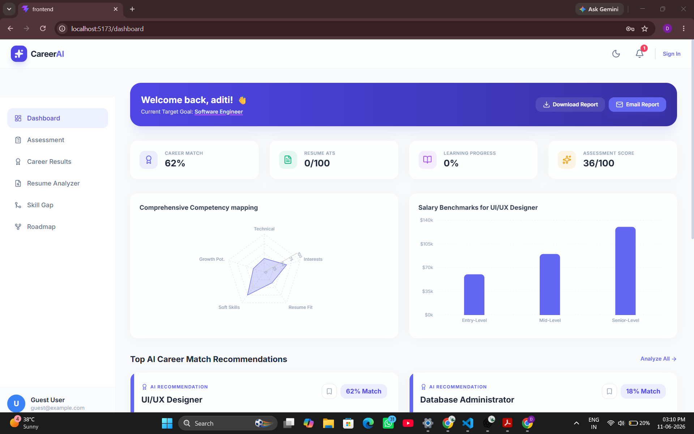
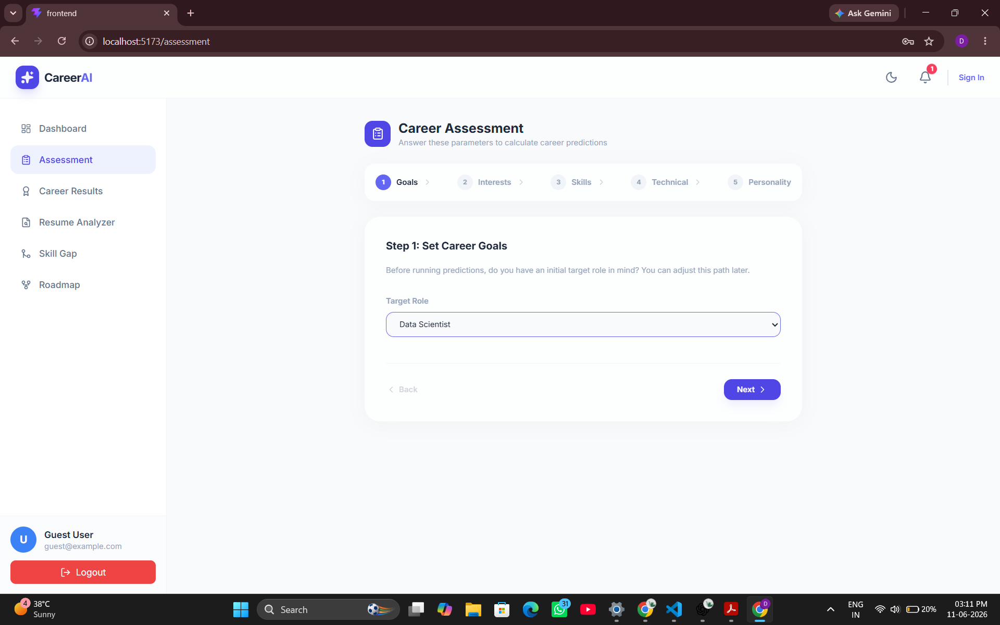
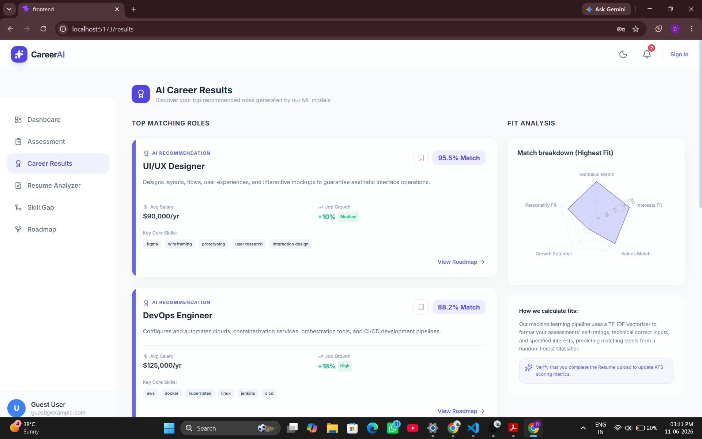
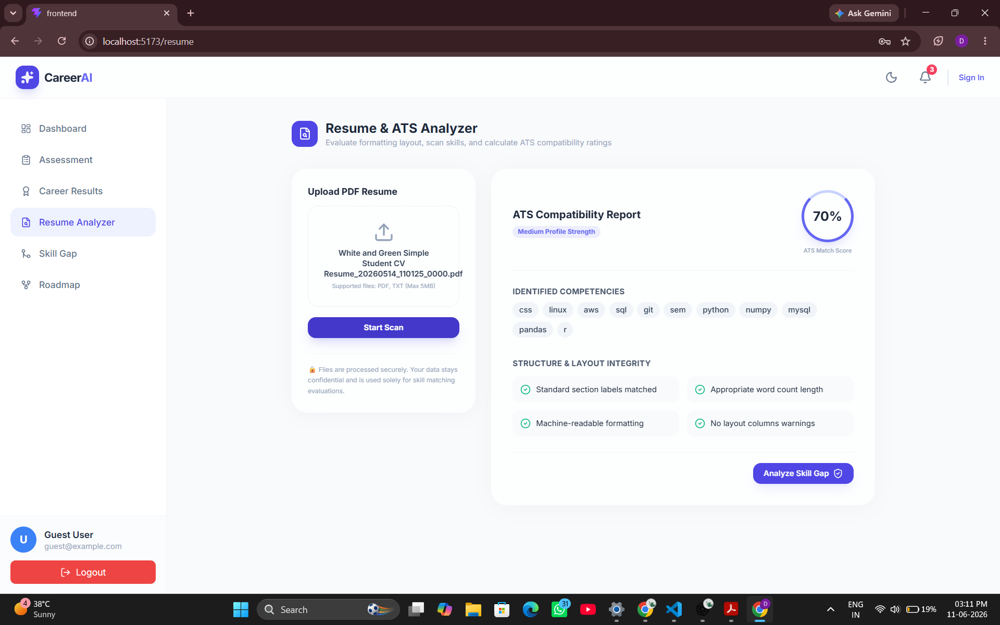
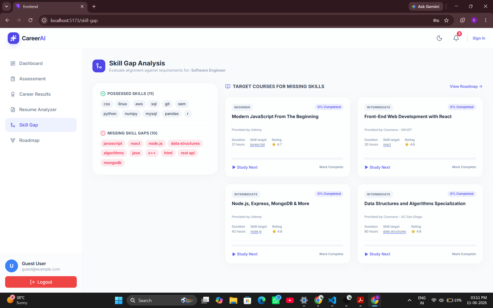
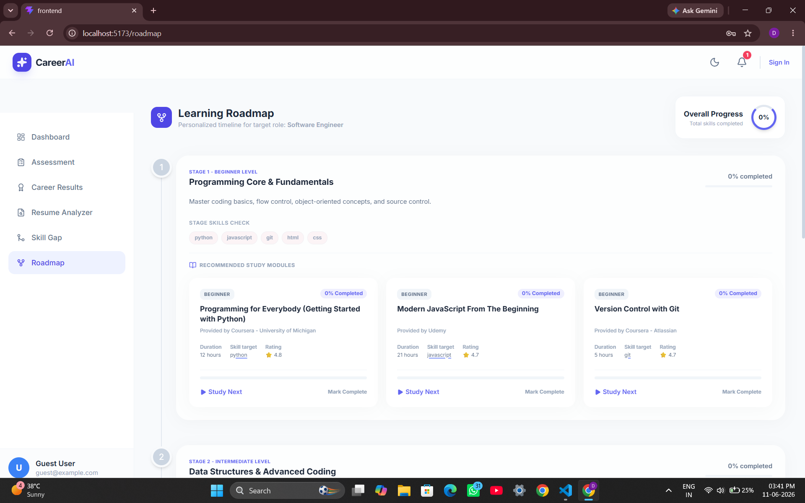

## Project Overview

With the rapid advancement of Artificial Intelligence, many traditional jobs are changing, and future career paths are becoming more complex. Students often face confusion when choosing a career because they receive conflicting advice from different sources and lack personalized guidance.

To address this problem, I developed the **AI-Powered Career Recommendation System**. This system analyzes a student's interests, skills, goals, and academic background to recommend suitable career paths. It provides personalized guidance, helping students make informed career decisions and focus on the skills required for their desired profession.

The goal of this project is to reduce career uncertainty and help students become more productive by following a clear and personalized career roadmap.

## Screenshots 
### Dashboard


### Assessment


### Career Result


### Resume Analyzer


### Skill Gap


### Roadmap



##  Features

- AI-Powered Career Recommendations
- Career Match Analysis
- Personalized Career Dashboard
- Resume ATS Scoring
- Skill Gap Identification
- Learning Progress Tracking
- Career Assessment System
- Personalized Learning Roadmaps
- Resume Analysis and Improvement Suggestions

## Tech Stack

-- Frontend:- 
React.js,
HTML5,
CSS3,
JavaScript,
REST API Integration,
-- Backend:- 
Flask,
Flask-CORS,
Python:-
-- Database:-
PostgreSQL,
-- Artificial Intelligence & Machine Learning:-
Sentence-BERT (SBERT),
Multilingual MPNet Embeddings,
VADER Sentiment Analysis,
Reinforcement Learning (Q-Learning),
Rule-Based Recommendation Engine,
-- Knowledge Representation:-
NetworkX Knowledge Graph,
-- External Integrations:-
Naukri API (Job Market Trends)


##  Installation

```bash
git clone https://github.com/your-username/ai-career-recommendation-system.git

cd ai-career-recommendation-system

# Frontend
cd frontend
npm install
npm run dev

# Backend
cd ../backend
pip install -r requirements.txt
python app.py
```
## Demo Link
## System Architecture
## Future Scope


